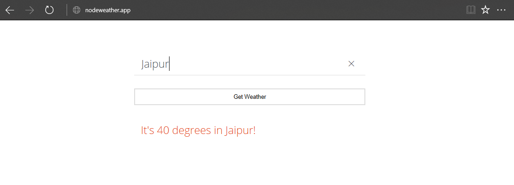

# NodeJSWeatherApp

> A simple node-express based web server that uses EmbeddedJS template engine and OpenWeatherMap API to fetch desired city's current temperature.




## Installation & Set-up

Requirements:
NodeJS
Following packages which can be installed by using ``npm install``
```sh
"dependencies": {
    "ejs": "^2.6.1",
    "express": "^4.16.3",
    "request": "^2.87.0",
    "yargs": "^11.0.0"
  }
```

## Release History

* 0.1.0
    * It works.
